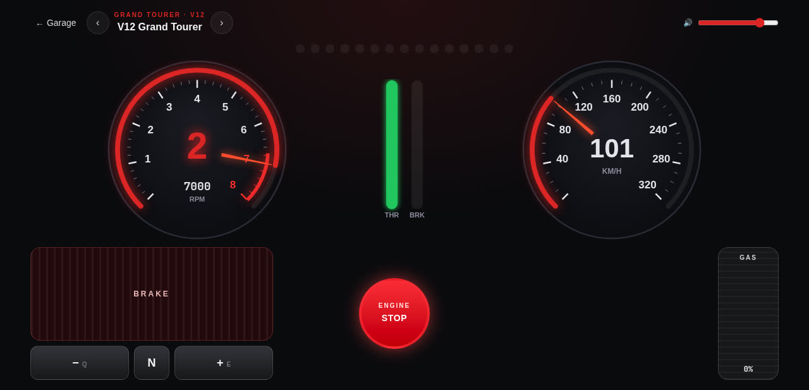
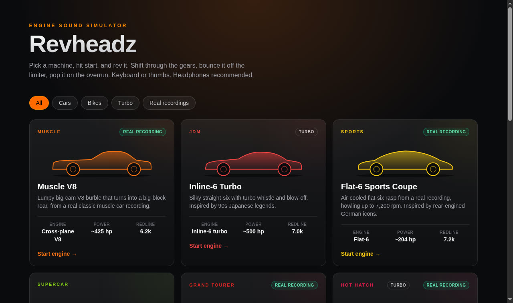
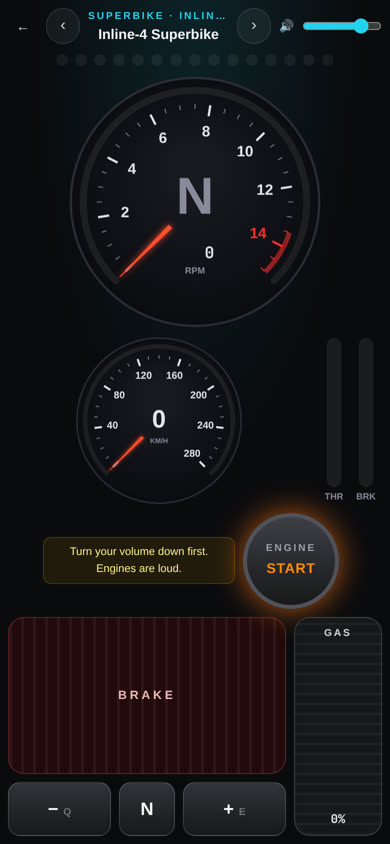
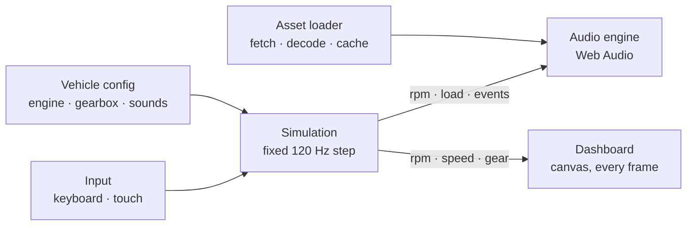

<p align="center">
  
</p>

# Revheadz 🏁

**Start it. Rev it. Shift it.** A free engine sound simulator that runs entirely in your browser.

Pick one of 15 machines, press the start button, and drive it with your keyboard or thumbs. The sound follows
every throttle input, gear change, limiter bounce and overrun pop in real time. Ten of the engines are real
professional recordings, and you can switch any of them to the engine-model sound to compare. No install, no account, no server.

<p align="center">
  
</p>

<p align="center">
  
  &nbsp;
  
</p>

## Features

- **15 vehicles**: a Grand Prix car, a GT race car, muscle, three twin-turbo sixes and V6s, supercars, a grand
  tourer, a hot hatch, a rally car, a rotary and two bikes
- **Real engine recordings** for ten of them, turned into RPM-mapped loops by a custom audio pipeline, with a
  **Real / Model** switch in the drive screen to hear the engine-model version instead
- **Live turbo sound**: a whistle and intake hiss that follow boost, plus blow-off "pssh" or compressor-surge
  "flutter" when you lift
- **Physics-based engine and gearbox**: inertia, torque curve, turbo lag, clutch slip at pull-away, drag and braking
- **Realistic shifting**: torque cut, a rev-matching blip on downshifts, and clutch engagement, heard through the
  engine note itself
- **Realistic deceleration**: engine braking that pulls harder in low gears, progressive brakes that ease off as you
  stop, and overrun crackle when you coast at high revs
- **Rev limiter, backfire pops and turbo blow-off**, which only fire when you actually coast, never on a gear change
- **Smooth sound**: all loops stay phase-locked and crossfade at constant loudness, so revving doesn't click or warble
- **Race-car dashboard**: canvas gauges, shift lights, throttle, brake and boost bars, a tachometer that bounces off
  the rev limiter, and an RPM readout down to the single rev
- **Works on phones, with multitouch**: hold the throttle with one thumb while you shift or brake with the other, in
  portrait or landscape
- **Installable**: add it to your home screen and it opens full-screen like an app, with its own icon
- **Garage with filters and a "Surprise me" button** that drops you into a random machine
- **Free to host**: a static site you can put on Vercel, Netlify or Cloudflare Pages

## Quick start

Requires Node.js 20+.

```bash
git clone https://github.com/SamarthPD-21/Revheadz.git
cd Revheadz
npm install
npm run dev          # http://localhost:3000
```

| Command | What it does |
|---|---|
| `npm run dev` | Development server with hot reload |
| `npm test` | Unit tests (simulation, gearbox, shifting, audio maths, configs, input) |
| `npm run build` | Runs the tests, then exports the static site to `out/` |
| `npm run lint` | ESLint |
| `npm run sounds` | Regenerates the procedurally generated sounds (needs `ffmpeg`) |

## Controls

| Keyboard | Touch | Action |
|---|---|---|
| `I` | **ENGINE START / STOP** button | Start or stop the engine |
| `W` / `↑` (hold) | **GAS** slider, right side | Throttle |
| `S` / `↓` (hold) | **BRAKE** pad, left side | Brake |
| `E` / `Q` | **+** / **−** paddles | Shift up / down |
| `N` | **N** button | Neutral |
| `Space` | | Quick throttle blip |
| `M` | 🔈 button | Mute / unmute |
| `F` | ⛶ button | Fullscreen |
| `[` / `]` | ‹ / › in the header | Previous / next vehicle |

> Turn your volume down before the first start. Engines are loud.
> On an iPhone, make sure the silent switch is off.

## The garage

| Vehicle | Engine | Gearbox | Redline | Sound |
|---|---|---|---|---|
| Grand Prix Racer | 2.4 L V8 | 7-speed sequential | 18,500 | 🎙️ Real recording |
| GT Race Car | Flat-plane V8 | 6-speed sequential | 8,800 | 🎙️ Real recording |
| Muscle V8 | Big-cam V8 | 6-speed manual | 6,200 | 🎙️ Real recording |
| Flat-6 Sports Coupe | Air-cooled flat-6 | 7-speed dual-clutch | 7,200 | 🎙️ Real recording |
| V12 Grand Tourer | V12 | 7-speed dual-clutch | 6,750 | 🎙️ Real recording |
| Hot Hatch Turbo-4 | Turbo inline-4 | 6-speed dual-clutch | 6,800 | 🎙️ Real recording |
| Inline-4 Superbike | Inline-4, 1000 cc | 6-speed quickshifter | 13,500 | 🎙️ Real recording |
| Inline-6 Turbo | Twin-turbo straight-6 | 6-speed manual | 7,000 | 🔧 Engine model |
| Twin-Turbo V6 AWD | Twin-turbo V6 | 6-speed dual-clutch | 7,000 | 🎙️ Real recording |
| Euro Twin-Turbo Six | Twin-turbo straight-6 | 7-speed dual-clutch | 7,300 | 🎙️ Real recording |
| V10 Supercar | V10 | 7-speed dual-clutch | 8,500 | 🔧 Engine model |
| Boxer-4 Rally Turbo | Turbo flat-4 | 6-speed manual | 7,000 | 🔧 Engine model |
| Twin-Rotor Rotary | 2-rotor Wankel | 5-speed manual | 8,500 | 🔧 Engine model |
| V-Twin Cruiser | 45° V-twin | 6-speed manual | 5,500 | 🎙️ Real recording |
| Synth V6 | V6 | 6-speed manual | 6,800 | 🎛️ Live synthesis |

Vehicle names are generic on purpose, with no brands or model names. Each engine's idle and redline match the
engine it was recorded from or modelled on.

## How it works



- **One owner of state.** Only the simulation changes engine state; audio and UI just read it. Because it steps at
  a fixed 120 Hz, a 60 Hz phone and a 144 Hz monitor behave the same.
- **React stays out of the hot path.** RPM and speed are drawn straight onto canvases every frame. React only
  re-renders when the gear or ignition changes (`useSyncExternalStore`).
- **Sample blending.** Each vehicle has looping recordings at several RPMs, for on-load (accelerating) and overrun.
  Each frame the two loops nearest the current RPM are crossfaded, pitched to match, and blended by engine load. Every
  loop starts at the same instant and is pitched by the same `rpm / sampleRpm` rule, so all loops stay in step.
  That keeps crossfades free of flanging and spikes.
- **Shifting in two phases.** First the drive cuts out. On an upshift the revs fall under engine braking; on a
  downshift an automatic blip matches revs, and you hear it. Then the clutch engages: revs blend onto the new gear
  and torque returns. Manual, dual-clutch and sequential gearboxes each have their own timing.
- **Lift-offs are judged.** Backfires, blow-off and overrun crackle only happen once the throttle has stayed shut for
  a moment without a gear change, so lifting to shift never triggers them.
- **Browser rules respected.** Audio starts only from the ignition tap, as autoplay policy requires. It pauses when
  the tab is hidden and fully stops when you leave the page.

### Where the sounds come from

**Real recordings.** Ten engines come from free, royalty-free [Sonniss #GameAudioGDC](https://sonniss.com/gameaudiogdc)
bundles: Pole Position Production, Dramatic Cat and Game Audio Factory. `scripts/build-real-sounds.mjs` turns raw recordings into
game-ready loops, using the manifest in `scripts/real-sounds.json`:

1. **Track the engine's speed** from its cycle frequency, the spacing of the harmonic "comb" every engine produces
   (RPM = cycle Hz × 120). Noisy sweeps can use hand-checked anchor points read off a spectrogram.
2. **Cut** steady-RPM sections, or slices of full-throttle runs, and **flatten their pitch** to one exact RPM.
3. **Loop** each section seamlessly with a correlated crossfade. Idle and steady holds can be left untouched to keep
   their natural character. Loops cut from a second recording can be EQ-matched to the first, so the change in mic or
   session isn't audible.
4. **Check**: adjacent loops' spectra are aligned by frequency scaling, and the scale is compared with their RPM
   labels, to catch a mislabelled loop (which would make the pitch jump).
5. **Finish**: use real deceleration loops for overrun where the recording has them (otherwise darker variants), normalise loudness along a smooth RPM curve, cut the real start-up and
   shutdown sounds, encode `.ogg` and `.mp3`, and write the vehicle config and credits.

**Engine model.** The other five come from `scripts/generate-sounds.mjs`, a physical engine model. It uses real firing
orders and crank angles, per-bank exhaust pipes with reflections, muffler resonances, intake roar, valvetrain noise,
turbo whistle and overrun crackle. The free recordings for these engines only covered idle and quick blips, which is
not enough for a full RPM range. Real-recording vehicles also get an engine-model set (in `sounds/gen/`) for the
**Real / Model** switch.

**Live synthesis.** Synth V6 is synthesised in the browser by an `AudioWorklet`, with no audio files at all.

```bash
node scripts/build-real-sounds.mjs            # rebuild all real-recording vehicles (needs ffmpeg; downloads sources once)
node scripts/build-real-sounds.mjs muscle_v8  # just one
npm run sounds                                # regenerate the engine-model sounds
```

Source recordings are cached in `.sound-cache/`, which is not committed.

## Project structure

```
app/                     Pages: garage (/), drive (/drive/[vehicleId]), credits
components/              React UI: Simulator, gauges, shift lights, controls, garage cards
hooks/                   useEngineState: the slow-changing state React subscribes to
lib/
  sim/                   Engine, Gearbox, Simulation: pure TypeScript, no React
  audio/                 AudioEngine, SampleLayer, SynthEngine (AudioWorklet), OneShots, blend maths
  assets/                Sound fetching, decoding and caching
  input/                 Keyboard and touch → throttle, brake and commands
  vehicles/              Typed configs, validation, build-time file checks
public/vehicles/<id>/    config.json + sounds/ (one folder per vehicle)
scripts/                 Sound pipelines: build-real-sounds, generate-sounds, audio-analysis
tests/                   Vitest suites
```

## Adding a vehicle

1. Copy a folder in `public/vehicles/` and edit `config.json`: `engine`, `gearbox` (including `type`), `dynamics`,
   optional `turbo`, and `ui`.
2. Give it sounds, in one of three ways:
   - **From recordings**: add an entry to `scripts/real-sounds.json` and run `node scripts/build-real-sounds.mjs <id>`.
   - **From the engine model**: add a voice to `VOICES` in `scripts/generate-sounds.mjs` and run
     `node scripts/generate-sounds.mjs <id>`.
   - **By hand**: drop in `.ogg` and `.mp3` loops named by RPM, and fill in the `audio` section.
3. Import the config in `lib/vehicles/index.ts` and add it to the list.
4. Credit its sounds in `credits.json`.

`npm test` and `npm run build` fail if a config is invalid or a referenced sound file is missing. They also fail if
the loudest loop at any RPM would be pitched too far from its recording.

## Deploying

The site exports to static files, so any static host works.

**Vercel:** import the repo at [vercel.com/new](https://vercel.com/new) and deploy; no settings needed. `vercel.json`
caches files under `/vehicles/` for a year, so rename a sound file when you change it. Every push to `main`
redeploys.

Optional environment variables:

| Variable | Purpose |
|---|---|
| `NEXT_PUBLIC_FEEDBACK_URL` | Shows a "Send feedback" link in the garage (e.g. a Google Form) |
| `NEXT_PUBLIC_SITE_URL` | Your custom domain, so social share images use absolute URLs |

Vercel's free Hobby plan is for non-commercial use. If you ever monetise, the same static build runs unchanged on
Netlify or Cloudflare Pages.

## Tech stack

[Next.js](https://nextjs.org) (App Router, static export) · TypeScript · [Tailwind CSS](https://tailwindcss.com) ·
Web Audio API with AudioWorklet · Canvas 2D · [Vitest](https://vitest.dev) · ffmpeg for the sound pipelines

## Credits

- Real engine recordings: **Pole Position Production** and **Dramatic Cat**, from the Sonniss #GameAudioGDC bundles,
  under the Sonniss GDC bundle license (royalty-free, commercial use allowed).
- Generated sounds and code: Revheadz.

The in-app **Credits** page lists every recording used.

Built from the MVP plan in `Engine Sound Simulator MVP — Detailed Plan.pdf`.
